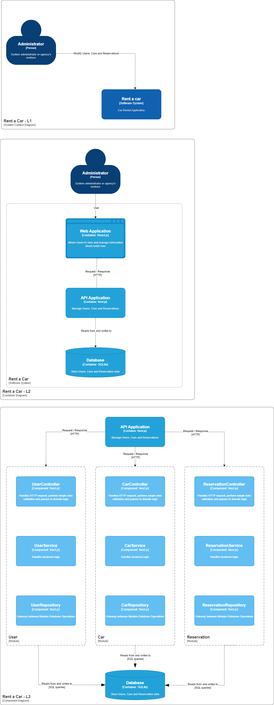

# Rent a car

CRUD / ABM implementado en Nest.js para añadir, ver, actualizar y eliminar autos.

## Installation

```bash
$ yarn install
```

## Running the app

```bash
# development
$ yarn run start

# watch mode
$ yarn run start:dev

# production mode
$ yarn run start:prod
```

## Test

```bash
# unit tests
$ yarn run test

# e2e tests
$ yarn run test:e2e

# test coverage
$ yarn run test:cov
```

## Diagram

The following diagrams are included to show the application architecture:


